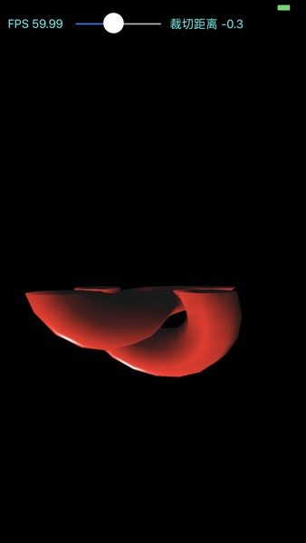

# 实现用户裁切平面（three.js webgl_clipping例子）
three.js中的webgl_clipping例子实现了指定用户裁切平面进行裁切的功能。在现代图形管线中，通过API指定用户裁切平面的功能已经废弃。但是这个功能很容易在shader中实现。

## 实现过程
webgl_clpping例子首先实现了环结几何体（torusknot geometry）数据的生成功能，接着使用phong shading对环结几何体进行渲染。随后指定用户裁切平面，在眼睛坐标空间对几何体进行裁切。（three.js在此处借助自己的框架实现优势，实现了更加复杂的场景。在例子中不仅轻松添加了阴影效果，并同时实现了对用户裁切平面功能在所有shader上的动态支持）

模仿webgl_clipping例子，只从实现用户裁切平面的角度，使用C++和OpenGL ES 3.0获得了如下的渲染效果，[iOS版本实现源码](https://github.com/nintymiles/LearnThreeJSRenderingExamples)可以从github上获取。

## Torusknot（环结）几何体生成

## 用户裁切平面的实现和裁切效果

